# 🏢 Hall Management System

A Hall Management System built using Java and MySQL to manage hall-related operations through a structured and centralized application.
The system implements user authentication, student and employee information management, and hall service modules using CRUD operations and object-oriented programming (OOP) principles.

It integrates a Java Swing–based user interface with a relational database, ensuring efficient data storage, retrieval, and validation.
The project demonstrates practical use of Java programming, database connectivity, and modular software design.

---

## 🛠️ Technical Stack

- **Programming Language:** Java  
- **GUI Framework:** Java Swing  
- **Database:** MySQL  
- **Database Management Tool:** phpMyAdmin  
- **Concepts Used:**  
  - Object-Oriented Programming (OOP)  
  - CRUD Operations  
  - Database Connectivity  
  - User Authentication & Validation  

---

## 📌 Project Overview

This project focuses on simplifying hall administration by digitizing key operations such as student information management, employee records, login systems, and hall services.  
The system ensures structured data storage, easy retrieval, and controlled access through authentication.

---

## 🎯 Core Features

- User Sign Up and Login system
- Student information management
- Employee information management
- Hall facilities overview
- Canteen service information
- Rules and regulations display
- Secure logout mechanism
- MySQL database integration

---

## 🖥️ Application Screenshots

### 🔹 Welcome Screen
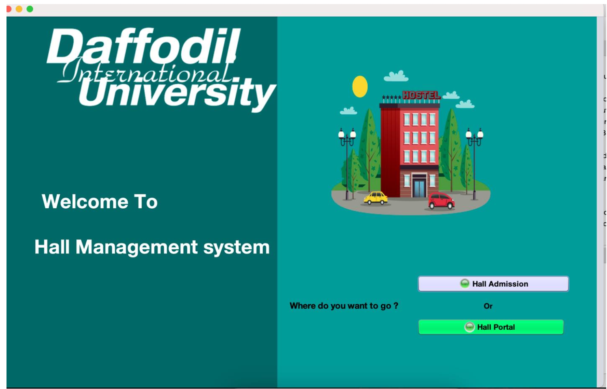
**Description:**  
Initial landing screen providing navigation options for hall admission and user portal access.

---

### 🔹 Sign Up Page
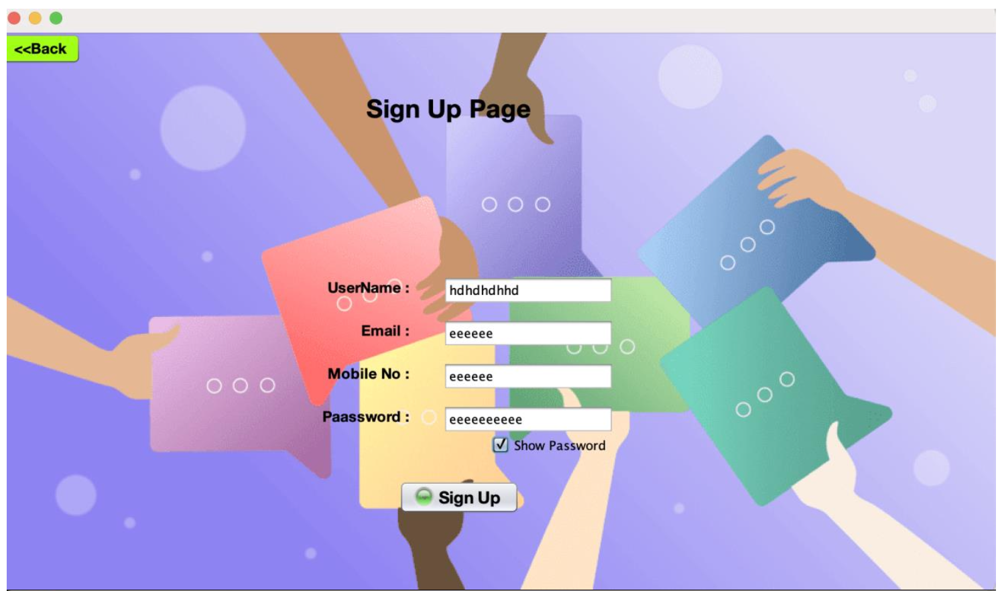
**Description:**  
Allows new users to register by providing username, email, mobile number, and password.

---

### 🔹 Login Page
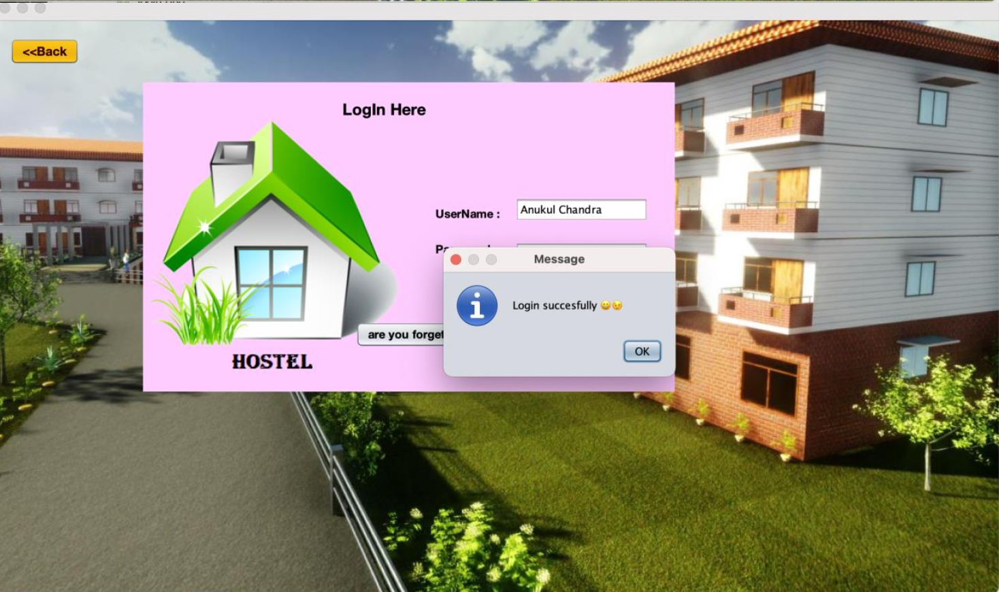
**Description:**  
User authentication screen with credential verification and error handling for invalid login attempts.

---

### 🔹 Dashboard / Navigation Panel
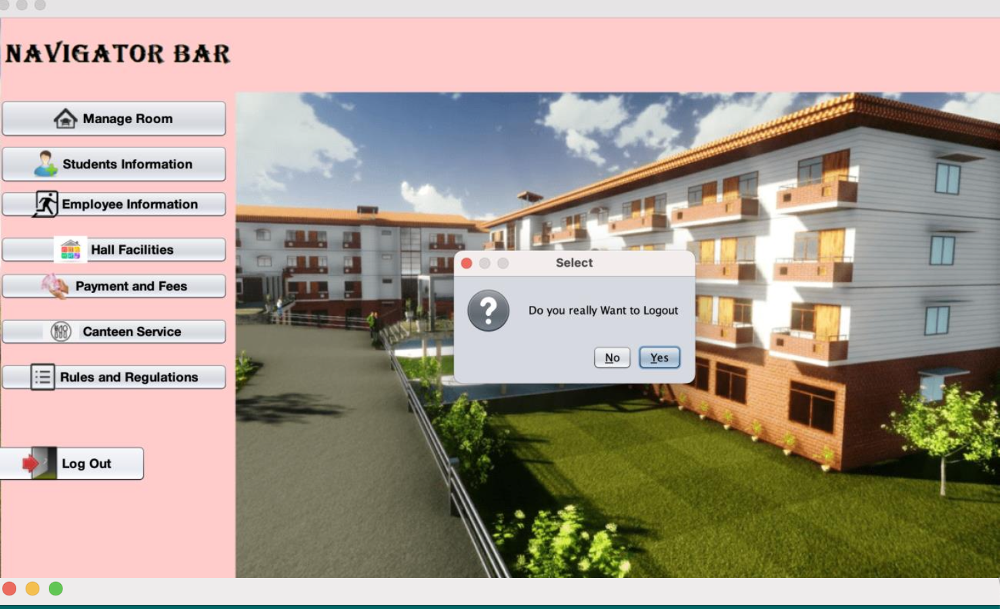
**Description:**  
Central navigation panel providing access to student information, employee details, hall facilities, payments, canteen service, and rules.

---

### 🔹 Student Information Module
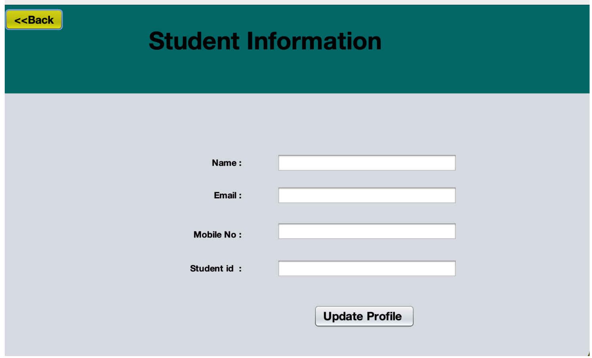
**Description:**  
Used to view and update student details such as name, email, mobile number, and student ID.

---

### 🔹 Employee Information Module
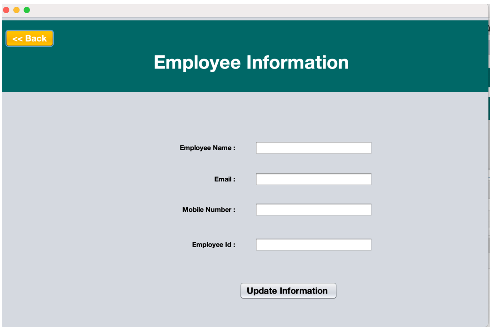
**Description:**  
Manages employee-related information including employee name, email, mobile number, and employee ID.

---

### 🔹 Hall Facilities
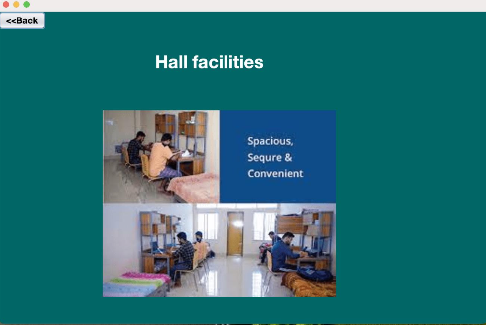
**Description:**  
Displays available hall facilities with visual representation for better understanding.

---

### 🔹 Rules and Regulations
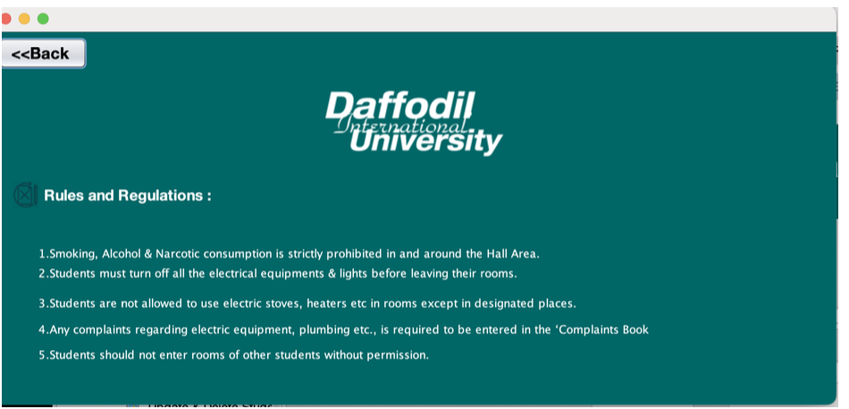
**Description:**  
Shows hall rules and regulations that students must follow to maintain discipline.

---

### 🔹 Database Overview
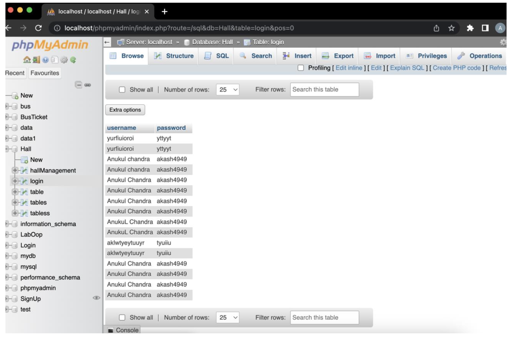
**Description:**  
Overview of database tables managed using phpMyAdmin for authentication and system data.

---

### 🔹 Student Database
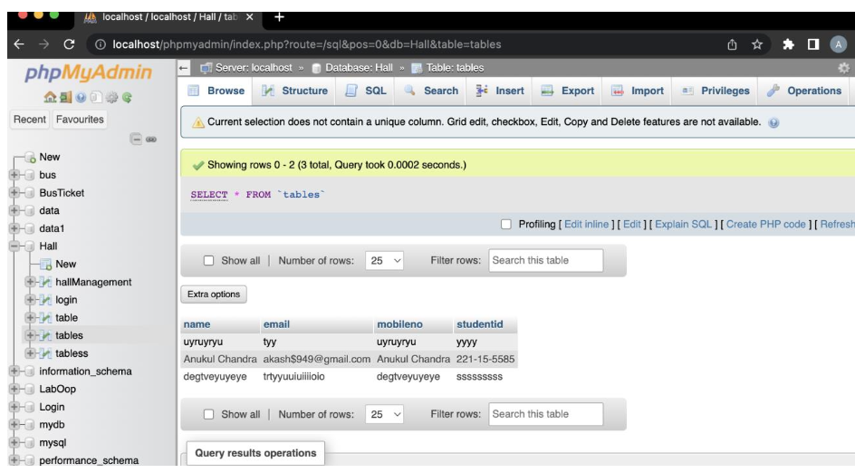
**Description:**  
MySQL table storing student information including name, email, mobile number, and student ID.

---

### 🔹 Employee Database
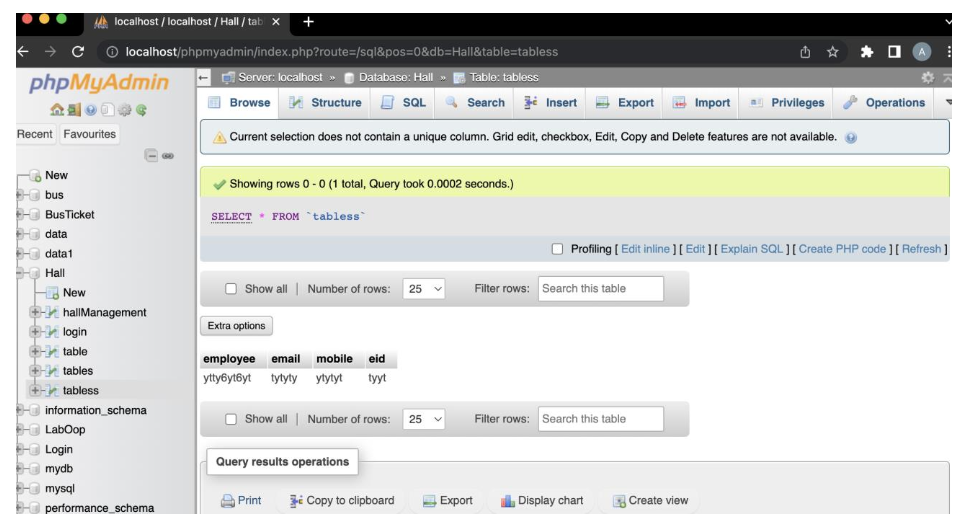
**Description:**  
Database table used to store employee details such as employee name, email, mobile number, and employee ID.

---

### 🔹 Sign Up Database
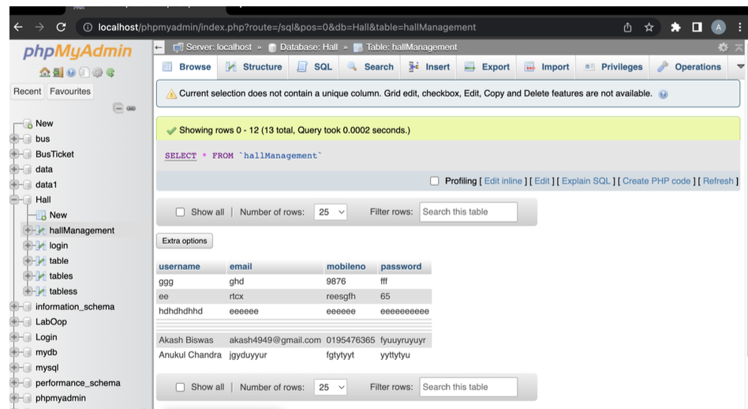
**Description:**  
Stores registered user credentials required for login and authentication.

---

## 🗄️ Database Structure

- **Login Database:** Handles user authentication  
- **Sign Up Database:** Stores user registration data  
- **Student Database:** Manages student records  
- **Employee Database:** Manages employee records  

Each module interacts with its respective database to ensure organized data handling.

---

## 🎥 Project Demo Video

📽️ **Video Link:**  
https://drive.google.com/file/d/1OyflP6aHVF5fMywpU5Yxj307G4reohR8/view?usp=sharing

---

## 🚀 How to Run the Project

1. Clone the repository:
   ```bash
   git clone https://github.com/your-username/hall-management-system.git
